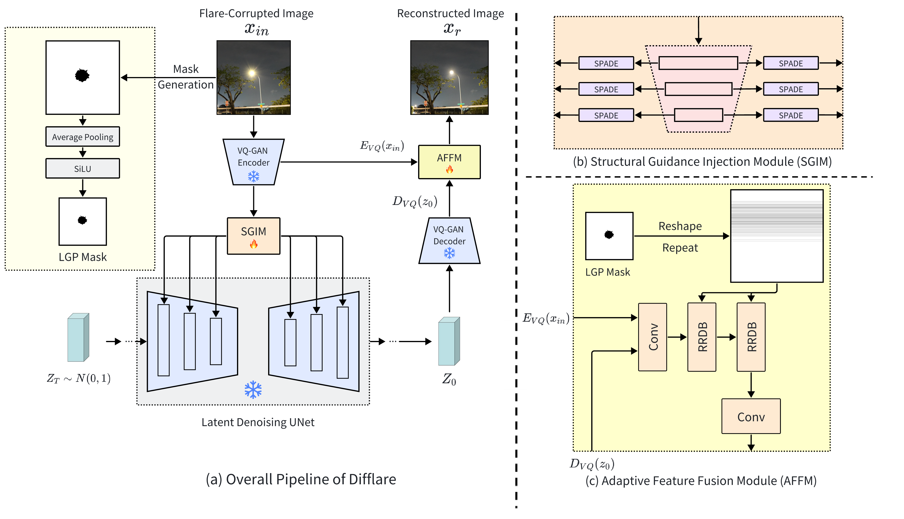








# 🎓 Bio
Tianwen Zhou is a post-graduate student in Department of Computer Science, University College London (UCL), majoring in Computer Graphics, Vision and Imaging. He is currently an intern researcher in AI Lab, Research and Development Center, Sony(China). He is a visiting student in Yale University, working with [Prof. Xiaofeng Liu](https://xliulab.mgh.harvard.edu/xiaofeng/). He is a visiting student in the Great Bay University(GBU), working with [Prof. Zitong Yu](https://zitongyu.github.io). He was a research assistant in Intelligent Media Computer Laboratory, Beijing Normal University, working with [Prof. Hua Huang](https://vmcl.bnu.edu.cn/group/teacher/dcdaea79b5e54b75b532795109a85a34.htm).\
His research interest includes Deep Learning and Computer Vision. He is currently working on Computational Imaging, Low-level Vision tasks, Multimodal Learning, as well as Medical AI.\
Feel free to get in touch with Tianwen Zhou via tianwenzhou0521[at]gmail.com *(preferred)* or tianwenzhou0521[at]ieee.org

*Note: The one on the top of the picture **with tie and glasses** is Tianwen Zhou.*

# 📖 Educations
- *2024.09-2025.09*(future), Master's degree of science in **Computer Graphics, Vision and Imaging**, School of Computer Science, University College London(UCL)
- *2020.09-2024.06*, Bachelor's degree of science in **Mathematics and Applied Mathematics**, School of Mathematical Science, Beijing Normal University(BNU)

# 🔥 News
* [2024.07] One paper is accepted by British Machine Vision Conference (BMVC 2024)! 

# 🎖 Honors and Awards
- *2024*, Distinguished Graduates, (Top 5%)
- *2024*, Distinguished Graduate Thesis Award, (Top 5%)
- *2024*, Awarded the title of **Lord** by the British Royal Family
- *2022-2023*, First-Class Academic Scholarship (Top 10%)
- *2022-2023*, First-Class Reward-based Scholarship (Top 10%)
- *2021-2022, 2022-2023*, Outstanding Student (Top 10%)

# 💻 Experiences
- *2024.05 - Now*, **Visiting Student** in Medical AI, X Lab, [Yale Institute for Global Health](https://medicine.yale.edu/), Yale University.
- *2023.08 - Now*, **Intern Researcher** in Computer Vision, [AI Lab](https://ai.sony/), Research and Development Center, Sony(China)
- *2023.10 - Now*, **Visiting Student** in Low-level Vision and Multi-modal Learning ,Yu Vision (YUV) Group, Great Bay University, China
- *2023.07 - 2023.08*, **Visiting Student** in NeRF & 3D Reconstruction, [AIR Lab](https://air.tsinghua.edu.cn/en/), Tsinghua University, China 
- *2023.05 - 2023.08*, **Data Product Intern**, Bytedance
- *2023.01 - 2023.04*, **Data Operation Intern**, Didichuxing
- *2022.11 - 2023.06*, **Research Assistant** in Infrared Imaging, Intelligent Media Computer Laboratory, Beijing Normal University

# 📒 Publications
#: equal contribution *: corresponding author

**Difflare: Removing Image Lens Flare with Latent Diffusion Models**  
**Tianwen Zhou**, Qihao Duan and Zitong Yu*.

**BMVC 2024 (Core A)** \| [Paper](https://bmva-archive.org.uk/bmvc/2024/papers/Paper_437/paper.pdf) \| [Code](https://github.com/TianwenZhou/Difflare) \| [Video](https://www.youtube.com/watch?v=naYsWT7SOn0)  <strong></strong>
- This work presents a novel paradigm for image lens flare removal.
- We utilize both the physics prior of lens flare and the prior encapsulated in pre-trained Latent Diffusion Models (LDM).

# 📪 Academic Services
**Congress Member**
* Member of Chinese Congress on Image and Graphics (CCIG)
* IEEE Student Member
* Member of British Machine Vision Association (BMVA) 
  
**Conference Reviewer** 
*  British Machine Vision Conference (BMVC) 2024
* IEEE International Joint Conference on Biometrics (IJCB) 2024

# 🔬 Invention Patents         
* A method, device, system, and storage medium for image lens flare removal. (一种图像杂散光去除方法、装置、系统和介质)
* A method, device, equipment and storage medium for generating medical image reports. (一种医学影像报告生成方法、装置、设备和储存介质)

# 🧑‍🏫 Teaching
* Will serve as Teaching Assistant(TA) in UCL Computer Science, 2025 Spring.

# 🛫️ Events
* Will be attending [BMVC 2024,Glasgow, UK](https://bmvc2024.org/)
