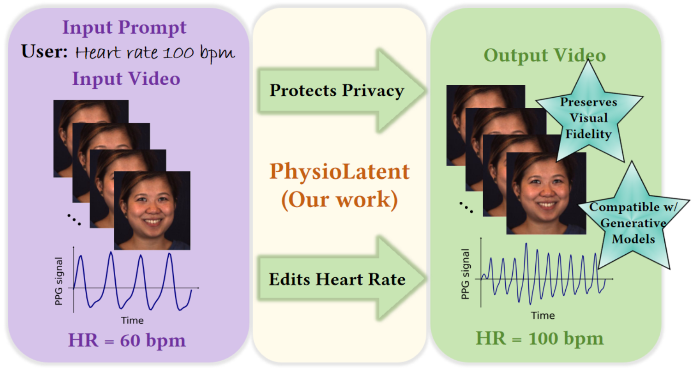
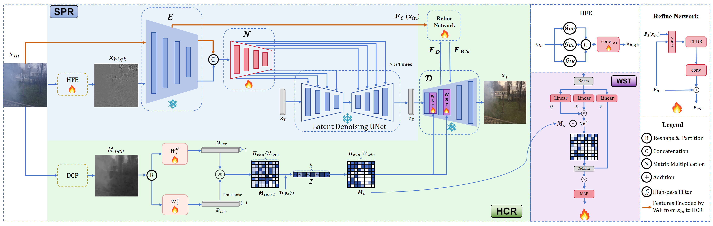
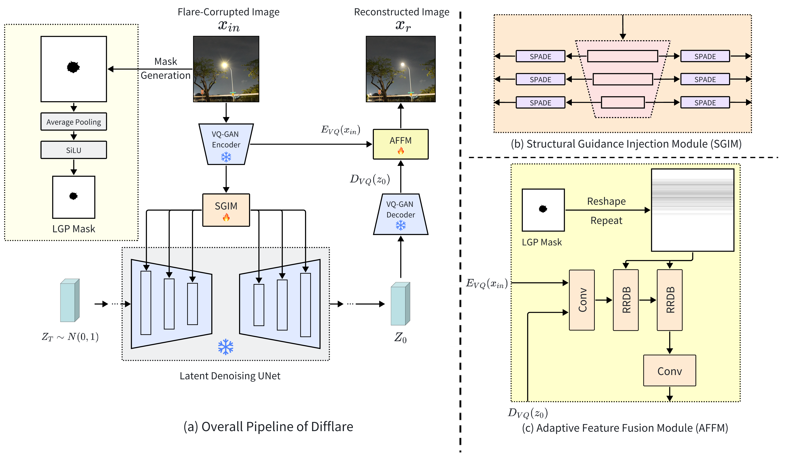








# 🎓 Bio
Tianwen Zhou is currently an AI Researcher in Data Storage Technical Research Dept, Huawei Technology co. Ltd. He received Master's degree in Computer Graphics, Vision and Imaging from Department of Computer Science, University College London (UCL). He received Bachelor's degree in Mathematics and Applied Mathematics from Beijing Normal University.
His research interest includes computer vision and multi-modal learning. He is currently working on Multimodal Understanding, KV Storage, LLM Inference, Network Topology, and Computational Imaging.\
Feel free to get in touch with Tianwen Zhou via tianwenzhou0521[at]gmail.com *(preferred)* or tianwenzhou0521[at]ieee.org

*Note: The one on the top of the picture **with tie and glasses** is Tianwen Zhou.*

🔥 News
- [Sep 2025] I joined Huawei Technologies Co., Ltd. as an AI Researcher!
- [Jun 2025] Our paper was selected as a Best Paper Candidate at ICME 2025!
- [Mar 2025] Our paper "ProDehaze: Prompting Diffusion Models Toward Faithful Image Dehazing" was accepted to IEEE ICME 2025 as an oral presentation!
- [Jul 2024] Our paper "Difflare: Removing Image Lens Flare with Latent Diffusion Models" was accepted to BMVC 2024!

# 📖 Educations
- *2024.09-2025.09*, Master's degree of science in **Computer Graphics, Vision and Imaging** (Distinction), School of Computer Science, University College London(UCL)
- *2020.09-2024.06*, Bachelor's degree of science in **Mathematics and Applied Mathematics**, School of Mathematical Science, Beijing Normal University(BNU)

# 🎖 Honors and Awards
- *2025*, Best Paper Nomination, ICME2025 (Top 1%)
- *2024*, Distinguished Graduates (Top 5%)
- *2024*, Distinguished Graduate Thesis Award (Top 5%)
- *2022-2023*, First-Class Academic Scholarship (Top 10%)
- *2022-2023*, First-Class Reward-based Scholarship (Top 10%)
- *2021-2022, 2022-2023*, Outstanding Student (Top 10%)

# 💻 Experiences
- *2025.09 -* **AI Researcher** in LLM, Data Storage Technical Research Dept, Huawei Technologies Co. Ltd.
- *2024.05 - 2024.12*, **Visiting Student** in Medical AI, X Lab, [Yale Institute for Global Health](https://medicine.yale.edu/), Yale University.
- *2023.08 - 2025.05*, **Intern Researcher** in Computer Vision, [AI Lab](https://ai.sony/), Research and Development Center, Sony(China)
- *2023.10 - 2024.10*, **Visiting Student** in Low-level Vision and Multi-modal Learning, Yu Vision (YUV) Group, Great Bay University, China
- *2023.07 - 2023.08*, **Visiting Student** in NeRF & 3D Reconstruction, [AIR Lab](https://air.tsinghua.edu.cn/en/), Tsinghua University, China 
- *2023.05 - 2023.08*, **Data Product Intern**, Bytedance
- *2023.01 - 2023.04*, **Data Operation Intern**, Didichuxing
- *2022.11 - 2023.06*, **Research Assistant** in Infrared Imaging, Intelligent Media Computer Laboratory, Beijing Normal University

# 📒 Publications
(*: corresponding author, #: equal contribution)

---

  

    
  

  

  **Editing Physiological Signals in Videos Using Latent Representations**  
  **Tianwen Zhou**, Akshay Paruchuli, Josef Spjut, and Kaan Akşit*.  

  [📄 Paper](https://arxiv.org/abs/2509.25348)

  

---

  

    
  

  

  **ProDehaze: Prompting Diffusion Models Toward Faithful Image Dehazing**  
  **Tianwen Zhou**, Jing Wang, Songtao Wu, and Kuanhong Xu*.  

  ICME 2025 (CCF-B, Core A) · Oral · Best Paper Nomination  
  [📄 Paper](https://arxiv.org/abs/2503.17488) \| [💻 Code](https://github.com/TianwenZhou/ProDehaze) \| [🌐 Project Page](https://zhoutianwen.com/prodehaze)  
  <strong></strong>  

  - Utilizes internal image priors to guide external priors from pretrained diffusion models, addressing hallucination issues in image dehazing.

  

---

  

    
  

  

  **Difflare: Removing Image Lens Flare with Latent Diffusion Models**  
  **Tianwen Zhou**, Qihao Duan, and Zitong Yu*.  

  BMVC 2024 (Core A)  
  [📄 Paper](https://bmva-archive.org.uk/bmvc/2024/papers/Paper_437/paper.pdf) \| [💻 Code](https://github.com/TianwenZhou/Difflare) \| [🎥 Video](https://www.youtube.com/watch?v=naYsWT7SOn0)  
  <strong></strong>  

  - Proposes a novel paradigm for image lens flare removal.  
  - Combines physics-based priors with knowledge from pre-trained Latent Diffusion Models (LDMs).

  

# 📪 Academic Services
**Congress Member**
* Member of Chinese Congress on Image and Graphics (CCIG)
* IEEE Student Member
* IEEE Signal Processing Society (SPS) Member
* Member of British Machine Vision Association (BMVA) 
  
**Conference Reviewer** 
* IEEE International Conference on Multimedia and Expo (ICME) 25',26'
* International Conference on Learning Representations (ICLR) 25',26'
* SciPy Proceedings 25'
* IEEE International Conference on Advanced Visual and Signal-Based Systems (AVSS) 25'
* British Machine Vision Conference (BMVC) 24'
* IEEE International Joint Conference on Biometrics (IJCB) 24'
* Conference on Neural Information Processing Systems (NeurIPS) 25'

# 🔬 Invention Patents         
* A method, device, system, and storage medium for image lens flare removal, granted. (图像杂散光去除方法、装置、系统和介质, CN118781007A)
* A method, device, equipment and storage medium for generating medical image reports. (医学影像报告生成方法、装置、设备和储存)

# 🛫️ Events
* Attended [ICME 2025, Nantes, France](https://2025.ieeeicme.org/)
* Attended [BMVC 2024, Glasgow, UK](https://bmvc2024.org/)

